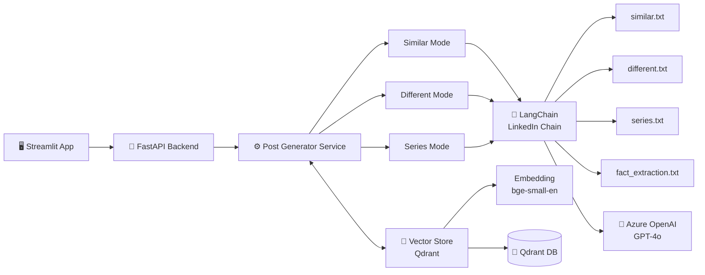
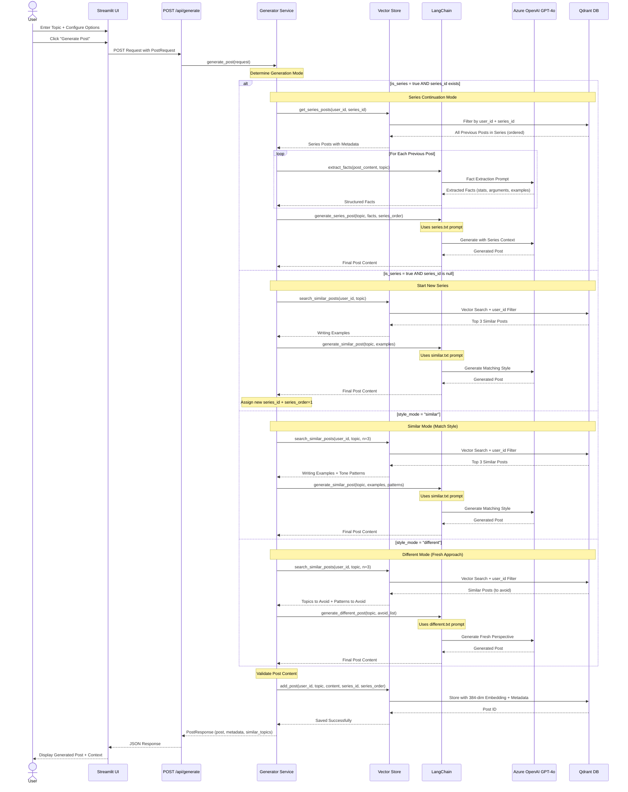

# 💼 LinkedIn Post Generator

An AI-powered LinkedIn post generator with **intelligent memory management** that learns from your writing style. Generate engaging posts that either match your established voice or bring fresh perspectives.

## ✨ What It Can Do

- **🎯 Smart Post Generation**: Create LinkedIn posts tailored to specific topics, tones, audiences, and lengths
- **🧠 Memory-Aware Writing**: Learns from your past posts to match your writing style or deliberately create fresh content
- **📚 Series Support** ⭐: **Create multi-part post series with automatic fact extraction and context awareness**. The system remembers all previous posts in a series, extracts key facts, and ensures continuity across posts - perfect for tutorials, case studies, or storytelling!
- **🔍 Topic Similarity Detection**: Automatically detects if you've written about similar topics before
- **💾 Persistent Memory**: Uses Qdrant vector database for efficient similarity search and retrieval
- **🎨 Multiple Styles**: Support for 6 tones, 6 audience types, and 3 length options
- **🖥️ Beautiful UI**: Interactive Streamlit interface for easy post creation

---

## 🏗️ Architecture

The application follows a modular architecture with clear separation between API, services, memory, and UI layers.




### 📊 POST /api/generate Flow

Detailed flow showing how the `/generate` endpoint processes requests and returns AI-generated posts:



---

## 💾 Database Structure

The application uses **Qdrant** as a vector database for efficient similarity search with metadata filtering. Here's how we structure and store posts:

```python
from qdrant_client.http.models import PointStruct
import uuid
from datetime import datetime

post_id = str(uuid.uuid4())                           # Unique UUID for each post
document = f"Topic: {topic}\n\nPost: {post_content}"  # Combined text used for embedding

embedding = (
    self.embedding_model
    .embed([document])[0]
    .tolist()
)                                                      # 384-dimensional FastEmbed vector

point = PointStruct(
    id=post_id,                                       # Unique identifier (UUID)
    vector=embedding,                                 # Vector used for semantic search
    payload={
        "user_id": user_id,                           # Links post to a specific user
        "topic": topic,                               # Main topic of the post
        "post_content": post_content,                 # Full generated LinkedIn post
        "document": document,                         # Text used to generate embedding
        "tone": tone,                                 # professional | casual | storytelling | etc.
        "audience": audience,                         # recruiters | engineers | founders | etc.
        "length": length,                             # short | medium | long
        "series_id": series_id,                       # Group ID for related posts (nullable)
        "series_order": series_order,                 # Order within series (nullable)
        "created_at": datetime.utcnow().isoformat()   # UTC timestamp of post creation
    }
)

```

**Key Design Decisions:**
- **Vector Embedding**: Enables semantic similarity search to find posts on related topics
- **Metadata Pre-filtering**: User ID and series ID allow filtering BEFORE vector search for performance
- **Series Fields**: Enable chronological ordering and context retrieval for multi-part content
- **Style Attributes**: Tone, audience, length help identify writing patterns for style matching

---

## 🤔 Why Qdrant over ChromaDB?

We chose **Qdrant** as our vector database for several technical advantages:

### 🚀 Performance Benefits

The key advantage is **metadata pre-filtering**. Qdrant filters your data (like finding posts from a specific user) *before* running the expensive vector search. This means it only searches through relevant vectors, making queries blazingly fast even with thousands of posts.
ChromaDB does it backward—it searches *everything* first, then filters. That's fine for small projects, but slows down as your data grows. Plus, Qdrant's disk-based persistence is production-ready, while ChromaDB is better suited for prototyping.
**TL;DR**: Qdrant = filter first, search second. Way faster at scale.


### 🎯 Key Advantage for Our Use Case

**Two-Stage Filtering** is critical for this application:

```python
# Qdrant: Efficient metadata pre-filtering
results = client.query_points(
    collection_name="linkedin_posts",
    query=embedding,
    query_filter=Filter(                          # ← Filters FIRST by user_id and series_id
        must=[
            FieldCondition(key="user_id", match=MatchValue(value=user_id)),
            FieldCondition(key="series_id", match=MatchValue(value=series_id))
        ]
    ),
    limit=3
)
# Result: Only searches vectors belonging to this user's series
```

With ChromaDB, the filter happens *after* vector search, meaning it searches ALL posts across ALL users, then filters - significantly slower as the database grows.


---

## 🧠 How Memory Works

The memory system is the core differentiator of this application. Here's how it creates personalized, context-aware posts:

### 1️⃣ **Embedding Generation**

Every post is converted into a 384-dimensional vector using **FastEmbed (BAAI/bge-small-en-v1.5)**:

```
Document = f"Topic: {topic}\n\nPost: {post_content}"
Embedding = FastEmbed.encode(Document) → [0.123, -0.456, ..., 0.789]
```

### 2️⃣ **Storage with Metadata**

Posts are stored in Qdrant with rich metadata:
- **User-specific indexing**: All posts tagged with `user_id` 
- **Series grouping**: Posts in a series share a `series_id`
- **Style attributes**: Tone, audience, length preserved for pattern matching

### 3️⃣ **Intelligent Retrieval**

**Two-Stage Filtering** for maximum efficiency:

```
Stage 1: Metadata Pre-Filter → Filter by user_id (and optionally series_id)
Stage 2: Vector Similarity → Find semantically similar posts
```

This approach is **much faster** than searching all posts then filtering.

### 4️⃣ **Context Building**

Based on the generation mode:

#### 📝 Similar Mode (Match Your Style)
```python
# Retrieve top 3 similar posts
similar_posts = vector_store.search_similar_posts(user_id, topic, n=3)

# Extract patterns
writing_examples = [post.content for post in similar_posts]
tone_patterns = [post.tone for post in similar_posts]

# Generate matching style
new_post = generate_similar_post(topic, writing_examples, tone_patterns)
```

#### 🔄 Different Mode (Fresh Perspective)
```python
# Find similar topics
similar_posts = vector_store.search_similar_posts(user_id, topic, n=3)

# Identify patterns to avoid
topics_to_avoid = [post.topic for post in similar_posts]
patterns_to_avoid = [(post.tone, post.audience) for post in similar_posts]

# Generate contrasting content
new_post = generate_different_post(topic, topics_to_avoid, patterns_to_avoid)
```

#### 📚 Series Mode (Continuity)
```python
# Get all posts in series (ordered)
series_posts = vector_store.get_series_posts(user_id, series_id)

# Extract facts from each post
all_facts = [extract_facts(post.content) for post in series_posts]

# Generate next post with context
new_post = generate_series_post(topic, all_facts, series_order=len(series_posts)+1)
```

### 5️⃣ **Similarity Threshold**

Posts with similarity score ≥ **0.75** are considered "topic exists":
- `0.90-1.00`: Nearly identical topic
- `0.75-0.89`: Similar topic, different angle
- `0.50-0.74`: Related but distinct
- `< 0.50`: Unrelated

### 6️⃣ **Fact Extraction (Series Only)**

For series posts, we extract key facts on-demand using a specialized prompt:
```
Facts Extracted:
- Key statistics/data points
- Main arguments made
- Examples/case studies mentioned
- Conclusions drawn
```

These facts ensure continuity and prevent contradictions across series posts.

---

## 🔌 API Endpoints

### 1. **Generate Post**

**`POST /api/generate`**

Generate a new LinkedIn post with memory-aware context.

#### Request Body

```json
{
  "user_id": "user_123",
  "topic": "The importance of work-life balance in tech",
  "tone": "professional",
  "audience": "engineers",
  "length": "medium",
  "style_mode": "similar",
  "include_emoji": true,
  "include_hashtags": true,
  "num_hashtags": 3,
  "is_series": false,
  "series_id": null
}
```

#### Parameters

| Parameter | Type | Required | Options | Default | Description |
|-----------|------|----------|---------|---------|-------------|
| `user_id` | string | ✅ | - | - | Unique user identifier |
| `topic` | string | ✅ | - | - | Post topic (3-500 chars) |
| `tone` | string | ❌ | `professional`, `casual`, `storytelling`, `inspirational`, `educational`, `humorous` | `professional` | Writing tone |
| `audience` | string | ❌ | `recruiters`, `engineers`, `founders`, `marketers`, `general`, `students` | `general` | Target audience |
| `length` | string | ❌ | `short` (100-300), `medium` (300-800), `long` (800-2000) | `medium` | Post length |
| `style_mode` | string | ❌ | `similar` (match past style), `different` (fresh approach) | `similar` | How to use memory |
| `include_emoji` | boolean | ❌ | `true`, `false` | `true` | Include emojis |
| `include_hashtags` | boolean | ❌ | `true`, `false` | `true` | Include hashtags |
| `num_hashtags` | integer | ❌ | 0-10 | 3 | Number of hashtags |
| `is_series` | boolean | ❌ | `true`, `false` | `false` | Part of a series |
| `series_id` | string? | ❌ | - | `null` | Series to continue (leave null for new series) |

#### Response

```json
{
  "post": "🚀 Work-life balance isn't just a buzzword...\n\n[Post content]\n\n#TechLife #WorkLifeBalance #Engineering",
  "topic_exists": true,
  "similar_topics": [
    {
      "topic": "Burnout in software engineering",
      "similarity_score": 0.82,
      "created_at": "2024-01-15T10:30:00Z"
    }
  ],
  "message": "You've posted about 'Burnout in software engineering' before (82% similar). I'll match your established style.",
  "metadata": {
    "tone": "professional",
    "audience": "engineers",
    "length": "medium",
    "style_mode": "similar",
    "generation_time_ms": 1523.5,
    "model_used": "gpt-4o",
    "series_id": null,
    "series_order": null
  }
}
```

---

### 2. **Get User History**

**`GET /api/history/{user_id}?limit=10`**

Retrieve a user's past posts.

#### Parameters

| Parameter | Type | Required | Description |
|-----------|------|----------|-------------|
| `user_id` | string | ✅ | User identifier (path parameter) |
| `limit` | integer | ❌ | Max posts to return (default: 10) |

#### Response

```json
{
  "user_id": "user_123",
  "total_posts": 25,
  "posts": [
    {
      "post_id": "uuid-1234",
      "topic": "Work-life balance in tech",
      "post_preview": "🚀 Work-life balance isn't just a buzzword. Here's why it matters...",
      "tone": "professional",
      "audience": "engineers",
      "created_at": "2024-01-20T14:30:00Z"
    }
  ]
}
```

---

### 3. **Get User Series**

**`GET /api/series/{user_id}`**

Get all series created by a user.

#### Parameters

| Parameter | Type | Required | Description |
|-----------|------|----------|-------------|
| `user_id` | string | ✅ | User identifier (path parameter) |

#### Response

```json
{
  "user_id": "user_123",
  "total_series": 2,
  "series": [
    {
      "series_id": "series-uuid-1",
      "total_posts": 3,
      "first_topic": "Introduction to Microservices",
      "last_topic": "Deploying Microservices at Scale",
      "created_at": "2024-01-10T09:00:00Z"
    }
  ]
}
```

---

## 🚀 How to Run the App

### Prerequisites

- Python 3.9+
- Azure OpenAI API access
- Git (optional)

### 1️⃣ Clone or Download

```bash
git clone <repository-url>
cd LinkedIn_Post_Generator
```

Or download and extract the ZIP file.

### 2️⃣ Set Up Environment Variables

Create a `.env` file in the root directory:

```env
# Azure OpenAI Configuration
AZURE_OPENAI_ENDPOINT=https://your-resource.openai.azure.com/
AZURE_OPENAI_API_KEY=your-api-key-here
AZURE_OPENAI_DEPLOYMENT=gpt-4o
AZURE_OPENAI_API_VERSION=2025-01-01-preview
```

### 3️⃣ Install Dependencies

```bash
pip install -r requirements.txt
```

This will install:
- FastAPI & Uvicorn (API server)
- LangChain & LangChain-OpenAI (LLM orchestration)
- Qdrant-client with FastEmbed (vector database)
- Streamlit (UI)
- Pydantic (data validation)

### 4️⃣ Start the FastAPI Server

```bash
cd app
uvicorn main:app --reload --port 8000
```

The API will be available at `http://localhost:8000`

You can view the auto-generated API docs at:
- Swagger UI: `http://localhost:8000/docs`
- ReDoc: `http://localhost:8000/redoc`

### 5️⃣ Start the Streamlit UI (Separate Terminal)

```bash
streamlit run streamlit_app.py
```

The UI will open automatically in your browser at `http://localhost:8501`

### 6️⃣ Generate Your First Post!

1. **Configure Settings** in the sidebar:
   - Enter your User ID (default: `user_123`)

2. **Create a Post**:
   - Enter a topic
   - Select tone, audience, and length
   - Choose **Similar** (match your style) or **Different** (fresh approach)
   - Optionally enable/disable emojis and hashtags
   - For series posts, check "Part of a Series"

3. **Click "Generate Post"** 🚀

4. **View Results**:
   - Generated post with metadata
   - Similar topics (if any)
   - Copy-paste ready format

### 7️⃣ (Optional) Series Workflow

**Start a New Series:**
1. Check "Part of a Series"
2. Select "Start New Series"
3. Generate Post #1

**Continue a Series:**
1. Check "Part of a Series"
2. Select "Continue Existing Series"
3. Pick the series from the dropdown
4. Generate the next post

The system automatically:
- Extracts facts from previous posts
- Numbers posts sequentially
- Maintains context and consistency

---

## 📁 Project Structure

```
LinkedIn_Post_Generator/
├── app/
│   ├── api/
│   │   └── post.py              # API route handlers
│   ├── chains/
│   │   └── linkedin_chain.py    # LangChain orchestration
│   ├── config/
│   │   └── settings.py          # Configuration management
│   ├── prompts/
│   │   ├── similar.txt          # Similar mode prompt
│   │   ├── different.txt        # Different mode prompt
│   │   ├── series.txt           # Series continuation prompt
│   │   └── fact_extraction.txt  # Fact extraction prompt
│   ├── schemas/
│   │   ├── request.py           # Request models
│   │   └── response.py          # Response models
│   ├── services/
│   │   └── generator.py         # Core generation logic
│   ├── utils/
│   │   └── validators.py        # Post validation
│   ├── vectorstore/
│   │   └── store.py             # Qdrant vector store
│   └── main.py                  # FastAPI app setup
├── qdrant_db/                   # Persistent vector database
├── streamlit_app.py             # Streamlit UI
├── requirements.txt             # Python dependencies
├── .env                         # Environment variables
└── README.md                    # This file
```

---

## 🎯 Tips for Best Results

1. **Build Your Memory**: Generate 5-10 posts first to establish your writing style
2. **Use Similar Mode**: For consistent branding and voice
3. **Use Different Mode**: When you want to explore new angles on familiar topics
4. **Series Posts**: Great for tutorials, case studies, or multi-part stories
5. **Experiment with Tones**: Try different combinations to find your sweet spot

---

## 🛠️ Technology Stack

| Component | Technology | Purpose |
|-----------|-----------|---------|
| **Backend API** | FastAPI | High-performance async API server |
| **UI** | Streamlit | Interactive web interface |
| **LLM** | Azure OpenAI (GPT-4o) | Post generation and fact extraction |
| **Vector DB** | Qdrant (local) | Semantic search and memory |
| **Embeddings** | FastEmbed (BAAI/bge-small-en-v1.5) | 384-dim semantic vectors |
| **Orchestration** | LangChain | LLM prompt management |
| **Validation** | Pydantic | Request/response schemas |

---

## 📝 License

This project is open-source and available for personal and commercial use.

---

## 🙏 Acknowledgments

Built with ❤️ using:
- **LangChain** for LLM orchestration
- **Qdrant** for vector search
- **FastEmbed** for efficient embeddings
- **Azure OpenAI** for powerful language models

---

**Happy Posting! 🚀**
